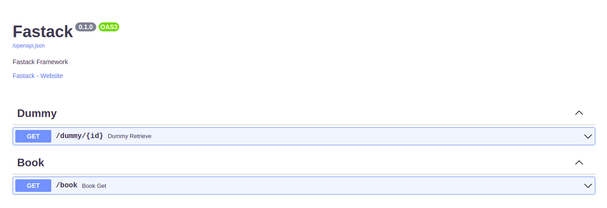
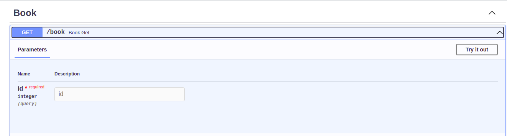
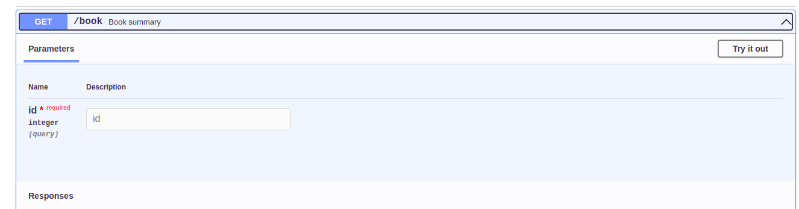

# Controller

What are controllers? controller is a class to define all methods (responder) into one endpoint. It follows the REST API architecture design.


Basically the REST API architecture design, provides one endpoint to perform Create, Read, Update and Delete (CRUD) operations. Example:

* HTTP method ``GET`` to read data
* HTTP method ``POST`` to add data
* HTTP method ``PUT`` for updating data
* HTTP method ``DELETE`` to delete data

Learn more here https://qatechhub.com/rest-api-introduction/

Other sources:

* https://www.oreilly.com/content/how-to-design-a-restful-api-architecture-from-a-human-language-spec/
* https://docs.microsoft.com/en-us/azure/architecture/best-practices/api-design

This feature is inspired by [Generic Views](https://www.django-rest-framework.org/api-guide/generic-views/) from Django Rest Framework.

## Create Controller

```
$ mkdir app/controllers/book && touch app/controllers/book/__init__.py
```

Open the created file using a text editor and copy the code below, then paste it into the file earlier.

```py title="app/controllers/book/__init__.py"
from fastapi import Response
from fastack.controller import Controller

class BookController(Controller):
    def get(self, id: int) -> Response: # (1)
        return self.json("Detail Book", { # (2)
            "id": id,
            "title": "blubuk blubuk"
        })
```

1. In this code we create a simple controller that provides a responder for the HTTP method ``GET`` with the query parameter ``id``.

2. In this code we return a JSON response with the shortcut ``#!python self.json(...)``

And add controller to ``app/controllers/__init__.py``. Example:

```py title="app/controllers/__init__.py"
from app.controllers.dummy import DummyController
from app.controllers.book import BookController # (1)

from fastack import Fastack


def init_controllers(app: Fastack):
    app.include_controller(DummyController())
    app.include_controller(BookController()) # (2)
```

1. First, we import the controller class

2. Then we add the controller to the Fastack instance.

!!! note

    When you add a controller, make sure it is an instance object of the controller.

if you run the app, you will see something like this



And when you open the ``Book`` tag, you will see something like this




## Additional route information

As you can see the path, summary, HTTP method, it's all created automatically by the controller. But, what if we want to change it manually? you can use ``fastack.decorators.route`` decorator to change that!

Example:

```py title="app/controllers/book/__init__.py"
from fastapi import Response
from fastack.controller import Controller
from fastack.decorators import route # (1)

class BookController(Controller):
    @route(summary="Book summary") # (2)
    def get(self, id: int) -> Response:
        return self.json("Detail Book", {
            "id": id,
            "title": "blubuk blubuk"
        })
```

1. We import ``route`` decorator to set route information to responder

2. We added the ``summary`` ourselves (not automatically generated by the controller)

And run it again and see what happens



Yeay, we successfully changed the summary for ``get`` responder.
So basically the ``route`` decorator is just for storing parameters to the method then passed to ``fastapi.APIRouter.add_api_route``. So, all parameters in ``fastapi.APIRouter.add_api_route`` can be used, except ``endpoint`` because this value is a method (responder).


## How it works?

Simple, when you define methods inside a class, which the class inherits from our Controller class. We will find all the methods that match the HTTP method using ``Controller.get_http_method()``.

If an HTTP method is found, we search the ``path`` for the responder using ``Controller.get_path()``. Then we add it to the router automatically.

So, basically the ``Controller`` class is just a container for the responder then put in the ``fastapi.APIRouter`` class. For more details, please see this code https://github.com/fastack-dev/fastack/blob/main/fastack/controller.py#L48


## Controller types

For now all controller types are used only as mixins. But in future, it will support ``ModelController`` like [ModelViewSet](https://www.django-rest-framework.org/api-guide/viewsets/#modelviewset) in DRF.

### Controller

This is the controller base for all controller types.

### CreateController

Controller to add data

### DestroyController

Controller to delete data

### ListController

Controller to show all data with pagination

### RetrieveController

Controller to get one data

### UpdateController

Controller to update data

### ReadOnlyController

It is a combination of ``RetrieveController`` and ``ListController`` controllers.

### CreateUpdateController

It is a combination of ``CreateController`` and ``UpdateController`` controllers.

### ModelController

It is a combination of ``CreateController``, ``DestroyController``, ``RetrieveController`` ``UpdateController`` and ``ListController`` controllers.
